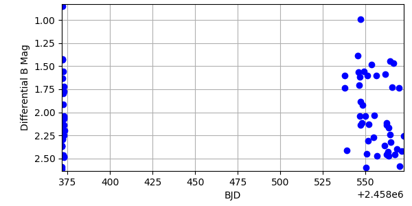
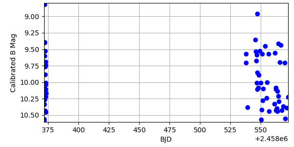
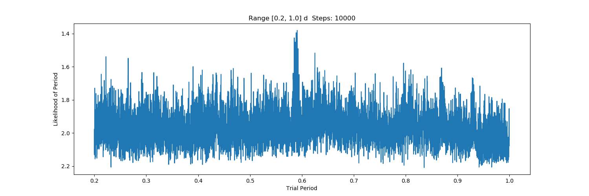

Cookbook
########

Below we offer some complete examples, with sample input data, which demonstrate some of the functionality and expected outputs.

Analysis of RX Eridanus
***********************

RX Eridanus is a variable star with known variability so it makes for an ideal demonstration of ``AstroSource``. The data we present shows variability but also has noise, so don't be alarmed by that.

The sample dataset is a time-series of photometry data of the variable star RX Eridanus. The data was taken by Michael Fitzgerald and Tim Jones on Las Cumbres Observatory's 0.4-meter optical telescopes in 2018-2019. The photometry has been extracted via a source extraction algorithm and for each image is saved into a corresponding CSV format file with the extension `.psx`.

Sample data
===========

Download data set from `FigShare <https://ndownloader.figshare.com/files/26563391>`_.

There are no `FITS` or other image files in this zip archive. All of the data are photometry tables saved in CSV format.

Once you have downloaded this data, unzip it.

Using Command Line Interface
============================

To use the command line interface (CLI) to perform the

.. code-block:: bash

  $ astrosource \
  --ra 72.43451 \
  --dec -15.74109 \
  --format psx \
  --indir <PATH TO DATA> \
  --full

Because we have a text file in CSV format with the extracted photometry, and not ``FITS`` file with the photmetry in a FITS Table, we need to explicitly tell ``astrosource`` which file extension to look for. ``astrosource`` will assume that every file in ``indir`` with the extension provided is one of our astrometry data files.

.. code-block:: bash

  --full

This is shorthand for running ``astrosource`` with the following options:

.. code-block:: bash

  --stars \
  --comparison \
  --calc \
  --phot \
  --plot

Outputs
-------

These are the output lightcurves, found in `outputplots/` for this dataset.

Differential Magnitude lightcurve

``astrosource`` automatically will attempt to perform calibrated lightcurve calculations. It does this by making an API call to online astronomical catalogues via the Python package ``astroquery``. If you are offline when you run ``astrosource`` you will not get a calibrated lightcurve.

The main issue with the dataset can be seen easily in this figures. The lightcurve has a large gap because the data were taken at 2 distinct epochs.

Period Folding
--------------

For a periodic timeseries, like variable stars or eclipsing binaries, ``astrosource`` has a period fitting feature. Using CLI you will have to run the full pipeline again with following inputs:

.. code-block:: bash

  --period \
  --periodlower 0.2 \
  --periodupper 1.0

Set reasonable guesses for the boundaries of your source. Having the `--periodlower` and `--periodupper` close to each other increases the resolution of the finding algorithm, which uses 10,000 steps between these bounds.

This makes our full ``astrosource`` call the following:

.. code-block:: bash

  $ astrosource \
  --ra 72.43451 \
  --dec -15.74109 \
  --format psx \
  --indir <PATH TO DATA> \
  --period \
  --periodlower 0.2 \
  --perdioupper 1.0
  --full

The outputs can be found in `periods/`. ``astrosource`` calculates the period via `Phase Dispersion Minimization (PDM)`.

First the maximum likelihood plot for all the possible periods in the range provided, where you can see a peak at `~0.6 days`.

Then the phase folded data, using the obtained period. We provide 2 identical traces of the data making it easier to see trends.

 .. image:: images/V1_PDMTestPeriodPlot_Calibrated.png
    :width: 100 %
    :alt: Period folded lightcurve

You can see that the estimated period is `0.59096 days`. The published value is `0.58725159 days` in an `ApJ Letter <https://iopscience.iop.org/article/10.3847/2041-8213/ab9538>`_.
